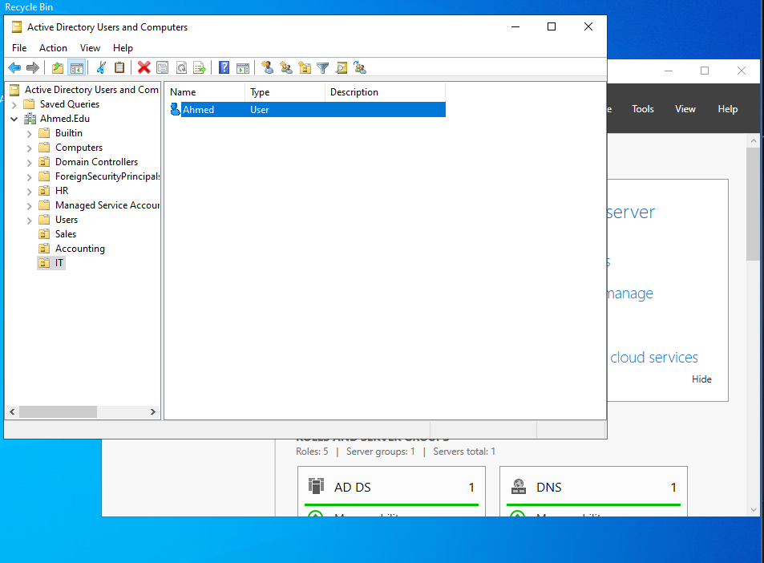
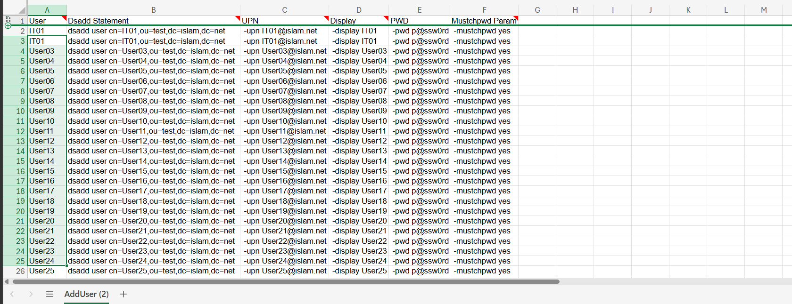

# Active Directory Lab

## Objective

Practice basic Active Directory administration tasks: checking domain user context, organizing users into OUs, and preparing bulk user creation commands.

## Lab Environment

- Domain shown in current lab screenshots: `Ahmed.Edu`.
- The bulk-user command sheet uses `islam.net` / `dc=islam,dc=net`, so I am treating that as older command-prep evidence until I confirm the final domain naming.
- Tools used: Active Directory Users and Computers, Command Prompt, and an Excel-style command sheet.
- The lab is running on VMware-based Windows Server/client machines.

## Implementation

### Domain session check

I checked the logged-in user context from the client with `whoami` and `whoami /user`. This confirmed the current domain user and SID.


### OU and user organization

I created or used OUs such as HR, IT, Sales, Accounting, and Users in Active Directory Users and Computers. The screenshot shows user `Ahmed` under the IT OU.



### Bulk user command preparation

I prepared a table that generates `dsadd user` commands with user names, UPN values, display names, passwords, and must-change-password options.

This screenshot shows command preparation, not a committed reusable script file.
It also shows an older/sample domain value, so I would update the sheet before using it in the current `Ahmed.Edu` lab.



## Commands and Scripts

Commands visible in the evidence include:

```cmd
whoami
whoami /user
dsadd user ...
```

No standalone script files are currently committed for this lab.

## Verification and Testing

- Domain user context was verified with `whoami`.
- OU placement was verified in Active Directory Users and Computers.
- Bulk user commands were prepared in a spreadsheet-style sheet.

## Troubleshooting

No Active Directory troubleshooting output is currently preserved for this lab.

## Results

The lab demonstrates basic AD user/OUs work and command preparation for bulk account creation.

## Lessons Learned

- OU structure matters before creating users in bulk.
- Command generation can speed up repetitive AD user creation.
- Screenshots are useful, but the actual scripts should also be committed later.

## Documentation TODO

- Add the actual CSV, spreadsheet, batch file, or PowerShell script used for bulk user creation.
- Confirm whether the bulk-user sheet should use `Ahmed.Edu` instead of the older/sample `islam.net` naming.
- Add output from a successful bulk user import.
- Add group membership screenshots if groups are created in a future lab.
