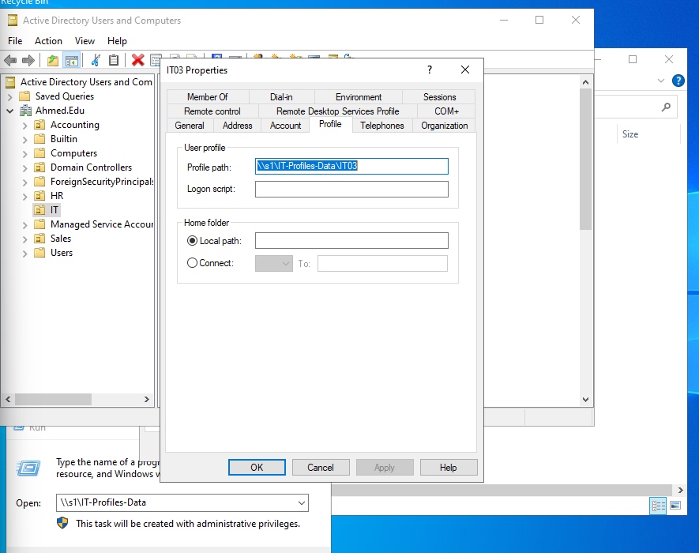
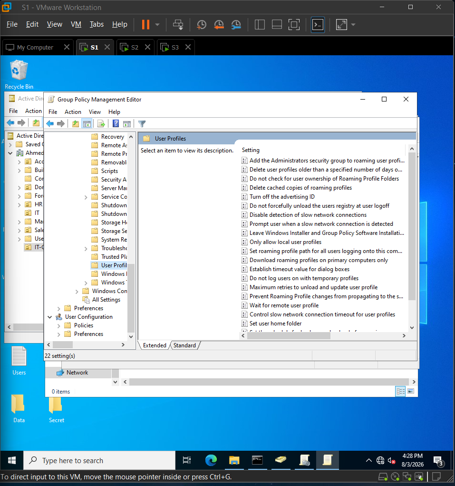

# Group Policy and User Profile Lab

## Objective

Practice roaming profile configuration and review User Profiles settings in Group Policy.

## Lab Environment

- Domain shown in related screenshots: `Ahmed.Edu`.
- Tools used: Active Directory Users and Computers and Group Policy Management Editor.
- Server/share path shown in screenshots: `\\s1\IT-Profiles-Data\IT03`.

## Implementation

### Roaming profile path

I configured a user profile path for a test user. The screenshot shows `IT03` using a profile path under `\\s1\IT-Profiles-Data\IT03`.

### Group Policy profile settings

I opened the User Profiles policy area in Group Policy Management Editor. The visible settings include administrator access to roaming profiles, profile cleanup behavior, cached roaming profile behavior, and related profile controls.

## Verification and Testing

The screenshots show the profile path entered and the GPO user profile settings opened. They do not show a full end-to-end roaming profile login test.

## Results

The lab documents practice with roaming profile paths and the GPO location where related user profile settings are managed.

## Lessons Learned

- Roaming profiles depend on both AD user profile paths and share/NTFS permissions.
- GPO profile settings should be tested with a real logon/logoff flow before calling the configuration complete.

## Documentation TODO

- Add the GPO name, scope, and linked OU.
- Add `gpresult` or `rsop.msc` verification.
- Add a login/logoff test showing profile creation and roaming behavior.
