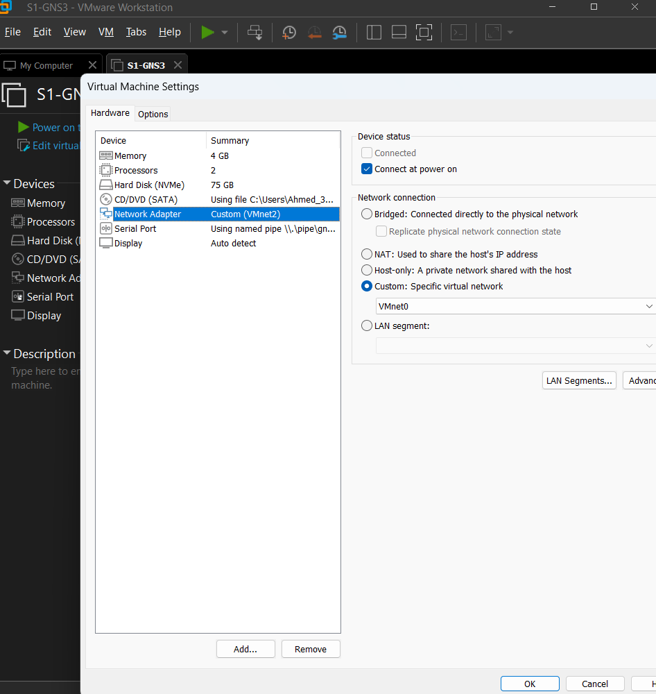

# Virtualization Lab

## Objective

Document the VMware network setup used to keep the Windows Server lab machines connected inside an isolated practice environment.

## Lab Environment

- VMware Workstation.
- Windows Server virtual machines.
- Custom VMware virtual network visible in the VM settings.

## Implementation

The VM network adapter was configured to use a custom VMware virtual network. This keeps the lab machines on the same lab network instead of relying on a normal bridged/NAT setup for every test.

## Verification and Testing

The VMware settings screenshot confirms the VM network adapter was set to a custom VMnet option.

## Results

The lab has a controlled virtual networking base for Windows Server and client testing.

## Documentation TODO

- Add a small network diagram.
- Add IP addressing and DNS/DHCP details after those labs are completed.
- Add VM names, roles, CPU, RAM, and disk sizing.
